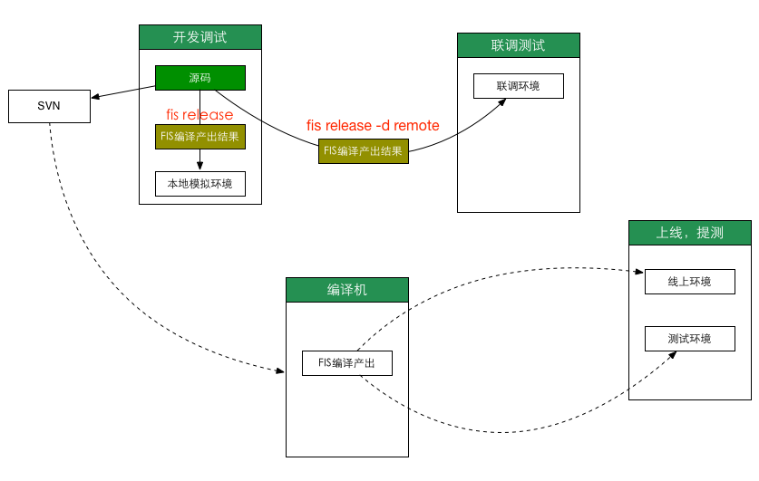

架构篇
==================

前端的难题不在于业务多复杂，而在于如何将其工程化。也就有了诸多利于工程化的工具，例如grunt、gulp、**fis**。

前端架构问题就是解决前端工程化的问题。以下这张表表述了一般一个前端项目的开发过程。

前端项目开发的过程大概是，开发调试->联调测试->提测、上线；

- 开发调试

    为了前端开发和后端开发并行，所以在本地开发调试这块需要有一个模拟环境模拟线上的真实环境。这样就可以做到**前后分离**

    **FIS提倡源码放在SVN管理，而由工具编译产出的结果在运行环境运行，不放在SVN中管理。**

    FIS提供的本地环境模拟，包括数据模拟，URL转发，模板渲染。

- 联调测试

    当开发完成后，需要跟后端进行联调，为了方便，开发工具会提供快速`deploy`数据到联调环境中功能。

- 提测、上线

    提测、上线这个环节，一般都是把编译产出打包，并发给测试或者上传上线。
    不过在百度内部是需要把编译产出放到产品库，由测试或者上线平台拉去进行测试、上线。

而在项目开发的各个环节，都会关注不同的问题，比如；

- 代码的拆分、组件化、目录组织
- 代码的打包上线
- 公共库的选择、优化
- 用less、scss等css预处理语言
- 要使用那个包管理工具来共享组件
- 静态资源合并、压缩
- 静态资源添加CDN
- 选择前端模板还是后端模板
- 如何方便的做本地调试
- 如何方便得部署代码到测试环境
- 如何解决本地源码目录和运行时目录不一致的问题
- 如何解决上线时遇到老旧版本静态资源访问穿掉的问题
- 如何做强缓存
- 利用localStorage增加文件缓存命中率
- minifest 缓存页面
- 静态资源按需加载

这些问题就将要在本方案中解决。当然这些问题的解决都集成在了FIS&解决方案中，但有必要阐述下，对于移动端，这些通用问题需要如何使用解决方案才能漂亮的解决。就好比大家都知道静态资源需要合并，但如何合并才能使整站的性能最优，又如何调整关键页的合并策略。

接下来的章节，就跟着文字使用FIS来解决这些问题。