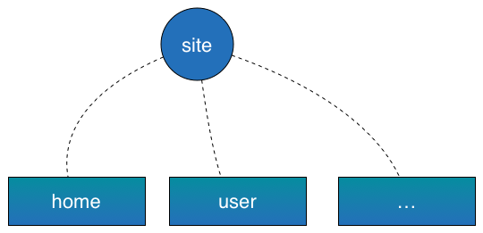

## 静态资源管理

### 目录
- 介绍
- 目录规范
- 组件化
- 公共库的选择
- 模板技术选型
- 静态资源加载
    - 按需加载静态资源

### 介绍

静态资源，包括源码中用到的`js`、`css`、`html`、`image`、`flash`、`video`等等，在网页开发中，大量用到了`js`、`css`、`html`，而一般开发`html`文件体现为各种模板。`php`、`smarty`、`velocity`等能作为模板。

所谓静态资源管理，就是对`js`、`css`、`模板`、`image`等的有效组合，使得在网站整体加载性能、维护上达到最优的手段。

这篇主要介绍在开发阶段静态资源是如何组织使得维护方便以及运行时如何加载静态资源。

### 目录规范

随着团队、项目越来越大，代码也随着变多。维护一套统一的目录规范是很重要的。统一的目录结果有很多好处，除了方便维护还可以通过工具来做一些自动化的工作。

在整个站点中，业务扩张后可能分为若干个子系统，比如用户子系统、支付子系统、分类子系统等。为了业务迭代，一般都会子系统单独功能升级，当然代码也就得按照子系统划分。假设我们把一个子系统的代码维护在一个svn下，并且用一个模块来标识一个子系统。这样一个站点就由多个子系统构成。

代码按照模块来维护，比如`common`、`account`等。

这样我们的一个站点的代码功能组织结构如下图；

当代码分成模块后，发现有些代码各个模块都需要用，那这个时候就会出现一个`common`模块来负责关心公共部分的代码。

当后续上线的时候，其他模块依赖于`common`模块即可，比如当给用户子系统添加功能时，抽象出了一些公共组件或者功能模块需要放到`common`里，那这时候上线的时候就需要关心两个模块`common`和用户子系统模块。

具体示例图如下；

上面已经说过，一个模块代码放入一个SVN仓库是比较理想的，这样一来模块就可以独立进行开发，不与其他模块相互牵扯，还可以减少代码分支合并冲突。

一个站点的代码分成多个模块进行维护，那模块里面应该怎么样组织会比较好一点呢？

### 组件化

### 公共库的选择

### 模板技术选型

### 静态资源加载

